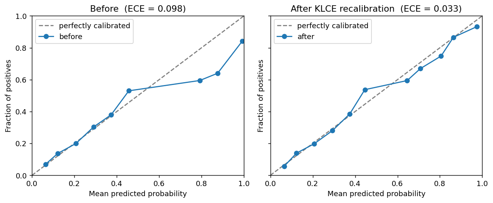

# KiTE — `kernel_calibration`

**Kernel-based AI Trustworthiness Examiner.** A JAX library to test if a
binary classifier is **locally calibrated**, identify areas of miscalibration,
and perform recalibration if needed.

[](https://github.com/ritwikvashistha/kernel_calibration/actions/workflows/ci.yml)
[](https://arxiv.org/abs/2501.15617)
[](LICENSE)
[](https://www.python.org)
<!-- Add on release: PyPI version and Zenodo DOI badges. -->

A model can look well calibrated *on average* and still be miscalibrated for
some particular regions of feature space such as an age band, an income bracket, a demographic
group. Standard metrics like ECE are not able to capture these gaps. **Kernel Local Calibration
Error (KLCE)** is a test statistic which can measure local miscalibration and tests it. It can also be used as a regularization penalty in the loss function to recalibrate a miscalibrated classifier. 

<p align="center">
  
</p>

The statistic, test, and diagnostic come from Vashistha & Farahi, *I-trustworthy
Models: A framework for trustworthiness evaluation of probabilistic classifiers*
(AISTATS 2025). A classifier is **I-trustworthy** if and only if it is locally
calibrated — equivalently, if and only if `KLCE² = 0`.

## What's in the box

| Function | What it does |
| --- | --- |
| `KLCE_test` | Permutation hypothesis test of the null *"the model is locally calibrated."* |
| `local_calibration_bias` | The **LCB "error-witness" diagnostic** — *where* in feature space the model is over/under-confident. |
| `recalibrated_model` | Train a small correction that enforces local calibration (KLCE penalty + distillation). |
| `select_bandwidths` / `median_heuristic` | Pick kernel bandwidths automatically. |
| `expected_calibration_error`, `maximum_calibration_error`, `brier_score`, `kernel_calibration_error` | Baseline metrics (incl. KCE, the global special case of KLCE). |
| `kernel_calibration.plots` | Reliability diagrams and LCB plots (needs `matplotlib`). |
| `make_calibration_data`, `datasets.fetch_compas` | Example data. |

## Install

```bash
pip install kernel_calibration          # once published to PyPI
```

From source:

```bash
pip install git+https://github.com/ritwikvashistha/kernel_calibration.git
```

With plotting extras:

```bash
pip install "kernel_calibration[viz]"
```

Runs on CPU out of the box (`pip` pulls a CPU `jaxlib`). Dependencies: `jax`,
`optax`, `numpy`; `matplotlib` for the optional plots. Python 3.9+.

## Quickstart

```python
import kernel_calibration as kc

# X: features to audit, y: labels, f: model's predicted probabilities
X, y, f = kc.make_calibration_data(n=1000, miscalibration=0.25, seed=0)

prob_w, x_w = kc.select_bandwidths(X, f)          # median-heuristic bandwidths
result = kc.KLCE_test(X, y, f, prob_w, iterations=500, key=0, x_kernel_width=x_w)

print(result.statistic, result.pvalue)
```

```text
KLCE^2 statistic = 0.00601
p-value          = 0.0020        # reject: the model is NOT locally calibrated
```

Then localize the problem:

```python
bias = kc.local_calibration_bias(X, y, f, prob_w, x_w)   # signed bias per point
# bias < 0  ->  over-confident there;  bias > 0  ->  under-confident there
```

...and fix it:

```python
model = kc.recalibrated_model()      # sensible defaults; kernel widths auto-selected
model.fit(f, X, y)
f_hat = model.predict_proba(f, X)    # locally calibrated probabilities
```

<p align="center">
  
</p>

## When to reach for KLCE

| Approach | Measures | Local? | Hypothesis test? | Localizes *where*? |
| --- | --- | :---: | :---: | :---: |
| ECE / Brier | global calibration (binned/average) | ✗ | ✗ | ✗ |
| KCE (Widmann et al. 2019) | global calibration (kernel) | ✗ | ✓ | ✗ |
| Multicalibration (Hébert-Johnson et al. 2018) | calibration within pre-specified groups | group-wise | ✗ | per-group |
| `fairlearn` group metrics | group performance/fairness | group-wise | limited | per-group |
| **KLCE (this package)** | **local calibration (every neighborhood)** | **✓** | **✓** | **✓ (LCB)** |

Use KLCE when you want a *principled test* of calibration **conditional on
features** — including protected attributes the model was never trained on — and a
diagnostic that points to the specific region or subgroup that is miscalibrated.

## Examples

Runnable notebooks in [`examples/`](examples/):

1. [**Quickstart**](examples/01_quickstart.ipynb) — run the test, read the result, visualize.
2. [**Recalibration**](examples/02_recalibration.ipynb) — fix a miscalibrated model; ECE ↓, AUC preserved.
3. [**COMPAS diagnostic**](examples/03_diagnostic_compas.ipynb) — audit a real recidivism model w.r.t. age & race and localize the bias.
4. [**Type-I error check**](examples/04_type_i_error.ipynb) — empirical evidence the test controls its false-positive rate.

## Documentation

Full API reference and guides: **<https://ritwikvashistha.github.io/kernel_calibration/>** (built from
this repo with MkDocs). Build it locally with `pip install -e ".[docs]" && mkdocs serve`.

## Contributing

Contributions are welcome — see [CONTRIBUTING.md](CONTRIBUTING.md) for the dev setup,
tests, and style, and [CHANGELOG.md](CHANGELOG.md) for the release history.

## Citation

Vashistha, R. & Farahi, A. (2025). I-trustworthy Models. A framework for
trustworthiness evaluation of probabilistic classifiers. *Proceedings of the 28th
International Conference on Artificial Intelligence and Statistics*, PMLR 258:4726–4734.
<https://arxiv.org/abs/2501.15617>

```bibtex
@inproceedings{vashistha2025itrustworthy,
  title     = {I-trustworthy Models. A framework for trustworthiness evaluation of probabilistic classifiers},
  author    = {Vashistha, Ritwik and Farahi, Arya},
  booktitle = {Proceedings of The 28th International Conference on Artificial Intelligence and Statistics},
  pages     = {4726--4734},
  year      = {2025},
  volume    = {258},
  publisher = {PMLR},
  url       = {https://arxiv.org/abs/2501.15617}
}
```

## License

MIT — see [LICENSE](LICENSE).
