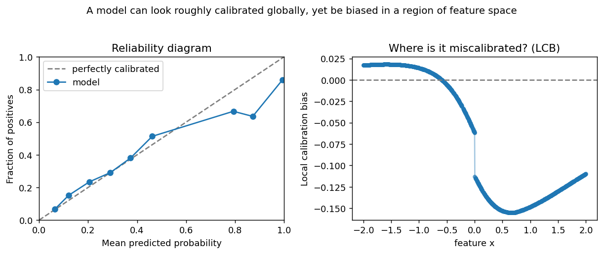

# kernel_calibration (KiTE)

**Kernel-based AI Trustworthiness Examiner.** A JAX library to test whether a binary
classifier is **locally calibrated**, to find **where** it is miscalibrated, and to
**fix** it.

A model can look well calibrated *on average* and still be systematically wrong for
particular regions of feature space — an age band, an income bracket, a demographic
group. Standard metrics like ECE average that gap away. **Kernel Local Calibration
Error (KLCE)** measures it, tests it, and localizes it.



The statistic, test, and diagnostic come from Vashistha & Farahi, *I-trustworthy
Models: A framework for trustworthiness evaluation of probabilistic classifiers*
(AISTATS 2025, [arXiv:2501.15617](https://arxiv.org/abs/2501.15617)). A classifier is
**I-trustworthy** if and only if it is locally calibrated — equivalently, if and only
if `KLCE² = 0`.

## Install

```bash
pip install kernel_calibration          # once published to PyPI
pip install "kernel_calibration[viz]"   # with plotting helpers
```

Runs on CPU out of the box. Python 3.9+.

## Quickstart

```python
import kernel_calibration as kc

# X: features to audit, y: labels, f: model's predicted probabilities
X, y, f = kc.make_calibration_data(n=1000, miscalibration=0.25, seed=0)

prob_w, x_w = kc.select_bandwidths(X, f)  # median-heuristic bandwidths
result = kc.KLCE_test(X, y, f, prob_w, iterations=500, key=0, x_kernel_width=x_w)
print(result.statistic, result.pvalue)  # small p-value -> not locally calibrated

bias = kc.local_calibration_bias(X, y, f, prob_w, x_w)  # where is it miscalibrated?
```

See the [Examples](examples.md) for end-to-end notebooks, including a real-data
fairness audit on COMPAS, and the [API reference](api.md) for every function.

## Citation

```bibtex
@inproceedings{vashistha2025itrustworthy,
  title     = {I-trustworthy Models. A framework for trustworthiness evaluation of probabilistic classifiers},
  author    = {Vashistha, Ritwik and Farahi, Arya},
  booktitle = {Proceedings of The 28th International Conference on Artificial Intelligence and Statistics},
  pages     = {4726--4734},
  year      = {2025},
  volume    = {258},
  publisher = {PMLR},
  url       = {https://arxiv.org/abs/2501.15617}
}
```
